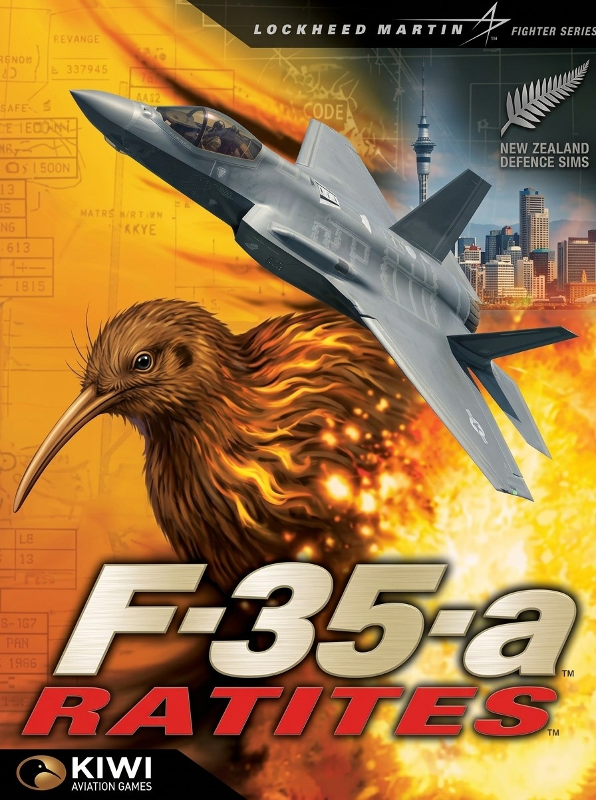
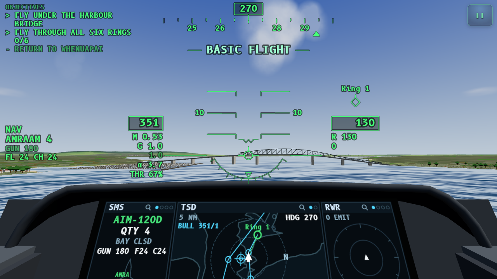
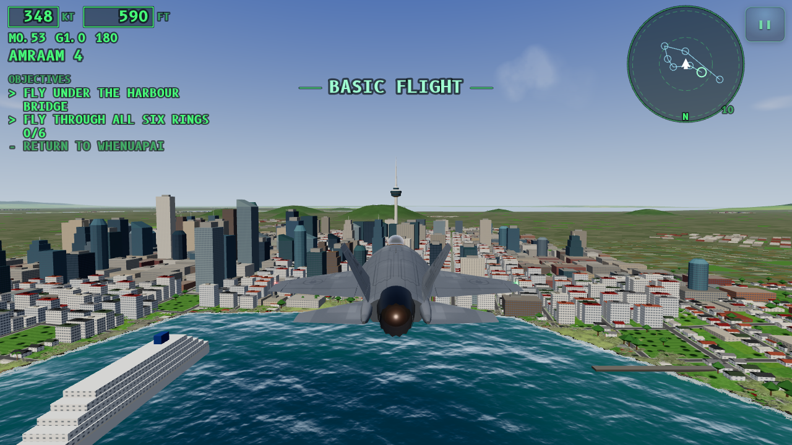

# F35-A Ratites

[](https://github.com/harell/F35-a/actions/workflows/ci.yml)
[](https://github.com/harell/F35-a/actions/workflows/deploy.yml)
[](https://github.com/harell/F35-a/actions/workflows/coverage.yml)

<p align="center"></p>

**A combat flight simulator for your phone's browser.** Fly the F-35A Lightning II over Auckland, New Zealand.
Defend the city: shoot down Shahed drones over the CBD, sink IRGC Navy fast boats in the Hauraki Gulf, dogfight MiGs and
Flankers over the Waitematā, and thread the Harbour Bridge at 40 m.

Inspired by NovaLogic's *F-22 Raptor* (1997). Built with three.js (WebGL 2), TypeScript and Web Audio, and installable as a PWA.

<p align="center"><em>Landscape · two thumbs · headphones recommended</em></p>

<p align="center">
  
  
</p>
<p align="center"><em>Left: cockpit view, lining up to fly under the Harbour Bridge. Right: chase view, inbound to the Sky Tower over the Waitematā.</em></p>

## Play

* **Play now:** https://harell.github.io/F35-a/ (GitHub Pages; redeployed automatically on every push to `master`).
  The PWA install and offline mode work from there.
* **Install (GitHub Pages build):** open it on your phone, then use *Share → Add to Home Screen* (iOS) or *Install app* (Android).
  It then runs full-screen in landscape and works offline.
* Runs in iOS Safari 15+, Android Chrome and desktop Chrome, Edge, Firefox and Safari.


## Analytics

The GitHub Pages build reports anonymous usage to [Microsoft Clarity](https://clarity.microsoft.com) (project `yr2ioa8r88`, see `src/analytics/clarity.ts`).
It is off in dev, on localhost, inside the embedded artifact build and under Playwright. Build with `VITE_CLARITY_ID=` (empty) to disable it, or set it to another project id.
Clarity can't see inside the WebGL canvas, so the useful data is the custom events (`mission_start`, `mission_success`, `mission_failed`, `mission_quit`, `player_down_*`, `menu_*`, …) and session tags (`mission`, `loadout`, `difficulty`, `quality`, `control_scheme`, `display_mode`, `build`). `build` is the GitHub Actions run number of the deploy (run #N under Actions → "Build & deploy F35-A"), also shown in-game as "Build N".

## Features

| | |
|---|---|
| **Flight model** | Force-based 6-DOF with an F-35-style fly-by-wire g/AoA command law, engine spool, afterburner fuel burn, energy bleed, transonic drag, and Auto-GCAS ground-collision avoidance (Recruit only: from Pilot up you can fly into the ground) |
| **Air-to-air** | Designation, then a nose-pointing ±30° radar lock (or a silent TWS shot). AIM-120D with loft, datalink and pitbull; AIM-9X with a ±90° HMD seeker and growl; GAU-22 25 mm with LCOS/funnel; a Pk-calibrated SHOOT cue on the DLZ |
| **Threats** | SA-6, SA-15, ZSU-23-4 and the IRGC Navy air-defence boat (a moving SAM with SA-18 MANPADS), with search → track → launch → guide. RWR, DAS missile warning, flares and chaff, beam-notching, terrain masking, EMCON pop-up ambushes, point defence, SEAD with AARGM and SDB |
| **Enemies** | MiG-29, Su-27, Su-35 and Su-57 flown by AI, Shahed-136 drones and IRGC Navy fast boats that uses its own sensors, flies BVR/BFM, defends against missiles and bugs out |
| **Cockpit** | F-35 HMD symbology plus a 3D cockpit with a panoramic display (TSD, SMS, FUEL, ENG, RWR, ICAWS, radar pages; tap to zoom) |
| **Views** | Cockpit, HMD-only, chase, orbit, padlock/target, missile cam, flyby and tactical map, plus a picture-in-picture target camera: a live head-on shot of the bandit, a slow orbit of the SAM site (radars spinning) or a wide orbit over open water round a ship, with name, range and radar state / aspect |
| **Sound** | Synthesized F135 roar and afterburner, gun, missile launches, explosions delayed by distance, RWR search/lock/launch tones, AIM-9 growl, "Bitching Betty" voice warnings, radio chatter, adaptive music |
| **Auckland** | Map-driven terrain from LINZ open data: Waitematā and Manukau harbours, Hauraki Gulf islands, volcanic cones, the real CBD (LINZ streets, and every building extruded from its outline to its 2024 LiDAR height) with the Sky Tower (built from its OpenStreetMap 3D model), the Harbour Bridge and the port. Fly into a CBD tower, a landmark or a span of the Harbour Bridge and it comes down, named on the HUD ("VERO CENTRE DESTROYED") and in the debrief. Whenuapai, Auckland Airport, Ardmore and North Shore (Dairy Flat) are their real OpenStreetMap layouts: runways, taxiways, aprons, hangars, and lighting driven from the real runway ends |
| **Civil traffic** | A320neos of *AeroFlop*, a fictional airline in Air NZ-style black-and-white colours, land on and depart from Auckland Airport's 05R/23L. They're a neutral side: enemy AI and SAMs ignore them, and they never get auto-locked or picked before a bandit. You *can* box and shoot one down, but AWACS calls check fire, it costs 500 points, and it shows in the debrief. At sea, container ships and cruise liners of the fictional *Kōtuku Line* lie moored at the port and Princes Wharf, swing at anchor in the outer Gulf, or steam slowly up the channel. They show (white, `CIV`) on the radar ground map and EOTS only, are skipped by TGT while a hostile of the selected weapon's kind is tracked (a tap still boxes them), and no AI, SAM or anti-radiation missile ever targets them. They ride the swell and swing at anchor, with funnel smoke, turning radars and, at night, navigation, cabin and deck lights. One bomb or missile sinks one (it burns, lists, settles by the bow or stern and is gone in 60–90 s), the gun wears them down over a few passes, and each costs the same as an airliner ("Civil ships destroyed" in the debrief). In A Stroll in the Park two more sail the harbour past the city and a crude carrier rides at anchor in the Gulf, so every airliner and merchant ship there can be boxed and shot. The harbour ferries are scenery in every mode: never on radar, never targetable. Key **I** shows or hides civil traffic (boxes, TSD and map symbols, and TGT): hidden at the start of every sortie, shown in A Stroll in the Park; a civil ship the mission asks you to protect (g02's tanker) is always shown |
| **Sky Tower** | A protected landmark. One stray bomb or missile from you brings it down: AWACS calls check fire, the mission fails on the spot and the tower topples onto the CBD. An enemy hit sets it burning; a second brings it down. It's rebuilt for every new sortie and every restart. The gun can't hurt it, and flying into it is fatal |
| **Campaign** | The IRGC campaign, against the Interspecies Revolutionary Guard Corps (New Zealand's invasive pests, organised into an army): a Shahed drone swarm over the city and a tanker escort through a IRGC Navy boat swarm in the Hauraki Gulf, 7 training lessons in campaign order (the seventh, before g03: StormBreaker or JDAM against sewer rats in Herne Bay), Instant Action (free flight, dogfight, SAM gauntlet, strike, defend) over Auckland, medals and debrief tips. There is no rearming: every sortie is flown on the loadout you take off with |
| **Difficulty** | Recruit, Pilot and Veteran, scaling AI skill, SAM reaction, missile lethality, countermeasure effectiveness, lock time, damage and G-LOC |
| **Mobile** | Floating side-stick, throttle with an afterburner detent, thumb buttons, optional tilt steering, haptics, safe-area aware, dynamic resolution, PWA/offline, wake lock |

## Controls

**Touch (default):** throttle lever on the left (drag past the detent for afterburner; double-tap toggles MIL/AB), floating side-stick on the right.
**FIRE** releases the selected weapon, **GUN** fires the gun, **CMS** drops flares and chaff, **WPN** cycles weapons, **TGT** designates/locks and steps through the selected weapon's targets (air with an A/A missile, ground with an A/G weapon, both with the gun, nearest in front first; civil traffic only once no hostile is left; the HUD warns, e.g. `AIR TGT: GUN OR A-A`, when the selected weapon can't engage the boxed target),
**CAM** changes view (long-press for padlock), **RADAR** toggles emission. Drag the empty centre of the screen to look around; tap a target box to designate it.

**Keyboard:** arrows/WASD pitch & roll · Q/E yaw · Shift/Ctrl throttle · Tab afterburner · Space gun · Enter fire · R weapon · T target ·
X countermeasures · C camera · V radar · I civil traffic (CIV boxes) on/off · P/Esc pause · mouse-drag look. **Gamepad:** standard mapping.

## Development

```bash
npm install
npm run dev          # http://localhost:5173 (use --host to test on a phone on the same Wi-Fi)
npm run typecheck    # tsc --noEmit
npm test             # vitest unit tests (flight model, missiles, radar, SAMs, AI, missions, terrain, HUD...)
npm run coverage     # the tests with V8 coverage: summary in the terminal, HTML report in coverage/index.html
npm run lint         # ESLint (typescript-eslint recommended); `npm run lint:fix` fixes what it can
npm run build        # production build to dist/
npm run e2e          # mission smoke test (headless Chromium)
node e2e/hd-terrain.mjs  # HD terrain download scope per quality tier (against `vite preview --port 4173`)
npm run voices       # regenerate voice clips (needs a local TTS + ffmpeg, see tools/)
```

CI runs the lint, the type check, the tests and the build on every pull request, and the deploy runs them again before
publishing. A separate workflow (`coverage.yml`) measures the coverage after each push to `master` and publishes the
badge's numbers on the `badges` branch (`tools/coverage-badge.mjs`); it never blocks a deploy.

Handy URL parameters: `?view=chase&difficulty=veteran&quality=high&fps=1` (`&hdterrain=0` turns off the high tier's HD terrain download).

Test hooks, on the dev server and in `npm run build:test` builds only (never in the deployed game): `?mission=g01&autostart=1` flies any mission straight away,
whatever the campaign has unlocked, and `window.__f35` exposes state, autopilot and fast-forward for Playwright.
Missions: `g01`–`g03` (the IRGC campaign), `t01`–`t07` (training), and Instant Action ids like `ia_dogfight_auckland`.
Playtesting (`/playtest`) is described in [`.claude/skills/playtest`](.claude/skills/playtest/SKILL.md) and logged in [`docs/playtests/`](docs/playtests/).

Architecture, conventions and module ownership are in [docs/ARCHITECTURE.md](docs/ARCHITECTURE.md). Developer labs for models,
effects, HUD, audio, UI and world live in [`labs/`](labs/).

## Credits

Everything is procedural (models, textures, sounds, terrain) except the items listed in [docs/CREDITS.md](docs/CREDITS.md):
three.js (MIT) plus a few MIT-licensed textures from its repository, the B612 Mono font (OFL 1.1), TTS-generated voice clips,
LINZ open data (CC BY 4.0) for Auckland's terrain, roads and CBD buildings, and OpenStreetMap data (© OpenStreetMap contributors, ODbL 1.0)
for its airfields and the Sky Tower model. The OSM bake is rebuilt with [`tools/osm`](tools/osm/README.md).

F35-A is a fan-made game. It is not affiliated with or endorsed by Lockheed Martin, the RNZAF, the USAF or NovaLogic.
Auckland geography is a stylised reconstruction, and the scenario is fictional.
